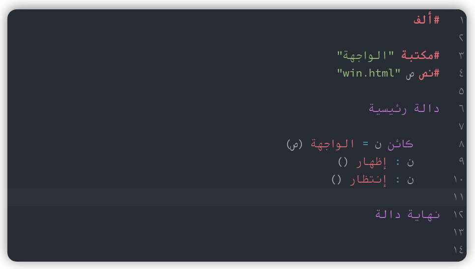

<div dir=rtl>

# محرر ألف [](https://github.com/alifcommunity/alif-editor/actions/workflows/build-and-deploy.yml)

https://alifcommunity.github.io/alif-editor/

هنا يوجد كود محرر ألف، الذي يمكن استخدامه ضمن تطبيقات عديدة مثل بيئة تطوير عن طريق صنع تطبيق سطح المكتب ب electron، أو عن طريق تشغيل بيئة التطوير على المتصفح مباشرة.

## لقطات شاشة

<div align=center>



</div>

## كيفية التشغيل محليا

> ملاحظة: يمكنك الاستخدام من خلال الموقع

متطلبات

<div dir=ltr>

```
npm install -g yarn	# تثبيت يارن
yarn                # تثبيت الاعتماديات
```

<div dir=rtl>

تشغيل

<div dir=ltr>

```bash
yarn start # لتشغيل الأكواد
```

<div dir=rtl>

## كيفية إعادة استخدام قواعد التلوين في مكان آخر

### أولا: codemirror v5

قواعد التلوين عبارة عن ملف واحد فقط موجود هنا: <span dir=ltr><code>src/codemirror/alif-simple-mode-states.js</code></span>.

كل ما عليك هو استخدامها هكذا:

  
<div dir=ltr>
  
```js
CodeMirror.defineSimpleMode("alif", 👉alifSimpleModeStates👈);
```
  
</div>

مع الأخذ في الحسبان إعداد محرر codemirror وجعله من اليمين لليسار وإضافة الشكل الخاص به (theme)، وتضمين لغات الجافاسكريب وال C-like، لأن لغة ألف يمكن أن يكتب بها هذه اللغات. ستجد هذه اللغات مضمنة في <span dir=ltr><code>src/codemirror/alif-mode.js</code></span>، والإعدادت هنا <span dir=ltr><code>src/codemirror/index.js</code></span>.

### ثانيا: codemirror v6

> يمكنك الإطلاع على مشروع [alifstudio3](https://github.com/alifcommunity/alifstudio3) لرؤية مثال واقعي عن طريقة استخدام قواعد التلوين في مشروع آخر.
  
قواعد التلوين تأخذ من نفس الملف، لكن الاختلاف يكمن في طريق الإعداد ومتطلبات التشغيل، إذ أنها تعمتد على الوحدات التي تستورد من خلال <span dir=ltr><code>import</code></span>، ثم يتم تَحزِيمُها في عن طريق مُحَزِّمات مثل parcel.

لإنشاء المشروع ثم البناء لتحصل على الملفات جاهزة للاستخدام، إذ يتم البناء في مجلد dist ستكتب ال html الخاص بك في ملف <span dir=ltr><code>./my-html-file.html</code></span> الموجود في المسار الجذر، ثم تضيف ملف الجافاسكريبت الخاص بك الذي سيكون به الاستيراد، مثل:

<div dir=ltr>

```html
<script src="./my-javascript-file-that-conatins-imports.js"></script>
```

</div>

كود الجافاسكريبت الخاص بك <span dir=ltr><code>./my-javascript-file-that-conatins-imports.js</code></span>، سيكون مشابها للموجود في <span dir=ltr><code>src/codemirror-v6/index.js</code></span>.

في النهاية ستقوم بالبناء وسينتج مجلد به ملف <span dir=ltr><code>./dist/index.html</code></span> مع باقي الملفات والأكواد، بحيث لو نقرت على ملف index.html وفتحته في المتصفح، ستجده يعمل دون الحاجة ل parcel أو npm أو yarn أو node. يمكنك أخذ المجلد الذي تم البناء فيه ووضعه في أي مكان أو استضافته وإعطاء نطاق له.

<div dir=ltr>

```bash
# my-html-file.html contains <script> which src the js
# file "./my-javascript-file-that-conatins-imports.js"
  
# parcel by default builds into `./dist`, but we can change it, for example to `my-dist`
  
# you can specify your library name if you want to use directly from the `window` object,
# for example when "./my-javascript-file-that-conatins-imports.js" contains exports as well,
# see `./alifstudio_data/src/index.js` in alifstudio3 repo, as example `export myFunction(){...}`
# now you can use it from the window like this: `window.alif.myFunctionName()` or you can
# simply use the function like this: `alif.myFunctionName()`

> yarn parcel build ./my-html-file.html --out-dir ./my-dist --global alif
```

</div>
  
## رخصة

MIT
