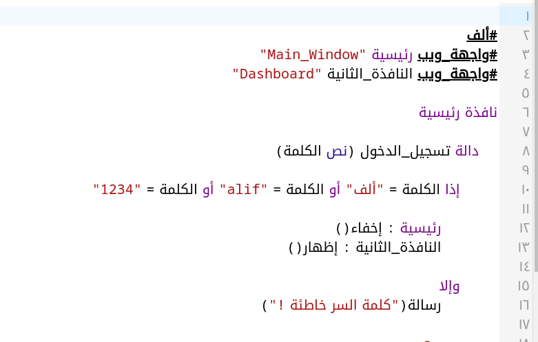
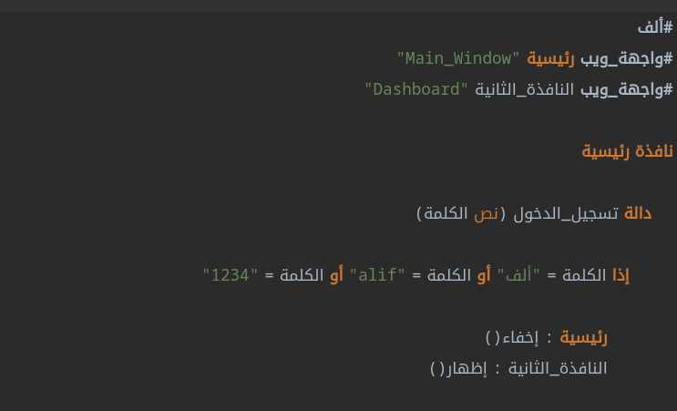

<div dir=rtl>

# محرر ألف [](https://github.com/alifcommunity/alif-editor/actions/workflows/build-and-deploy.yml)
  
https://alifcommunity.github.io/alif-editor/
  
هنا يوجد كود محرر ألف، الذي يمكن استخدامه ضمن تطبيقات عديدة مثل بيئة تطوير عن طريق صنع تطبيق سطح المكتب ب electron، أو عن طريق تشغيل بيئة التطوير على المتصفح مباشرة.

## لقطات شاشة




## كيفية التشغيل

<div dir=ltr>

```bash
npm install -g yarn
npm install -g parcel-bundler

yarn       # لتصطيب الاعتماديات
yarn start # لتشغيل الأكواد
```
  
</div>

## رخصة

MIT
